# 👩‍💼 Employee Management System (Spring Boot + Spring MVC + JPA + MySQL)

A full-featured web-based Employee Management System built using **Spring Boot**, **Spring MVC**, **Spring Data JPA**, **JSP/JSTL**, and **MySQL**. This application allows you to **add**, **update**, **view**, and **delete** employee details, with a secure **Spring Security-based login** system.

---
## 📽️ Project Demo

📺 [Click here to watch the demo video](https://drive.google.com/file/d/1t-zQaxhdLjyyCOWZjmm7Zx1A7zqpTzAJ/view?usp=drive_link)

---

## ✨ Features

- ✅ Add New Employees
- ✅ Update Existing Employees
- ✅ Delete Employees
- ✅ View All Employee Records
- ✅ Admin Login (Spring Security)
- ✅ JSP Pages for UI
- ✅ MVC Architecture with Service & Repository layers
- ✅ MySQL Database Integration
- ✅ Form validation & Session handling

---

## 🔧 Tech Stack

| Layer              | Technology Used                   |
|--------------------|------------------------------------|
| Backend            | Java, Spring Boot, Spring MVC     |
| View Layer (UI)    | JSP, JSTL                         |
| Persistence        | Spring Data JPA, Hibernate         |
| Database           | MySQL                             |
| Security           | Spring Security (Basic Auth)      |
| Build Tool         | Maven                             |
| Java Version       | 17                                 |
| Server Port        | 5000 (Configured in `application.properties`) |

---

## 📸 Screenshots

| 🏠 Home Page | 🔐 Login Page |
|-------------|---------------|
| 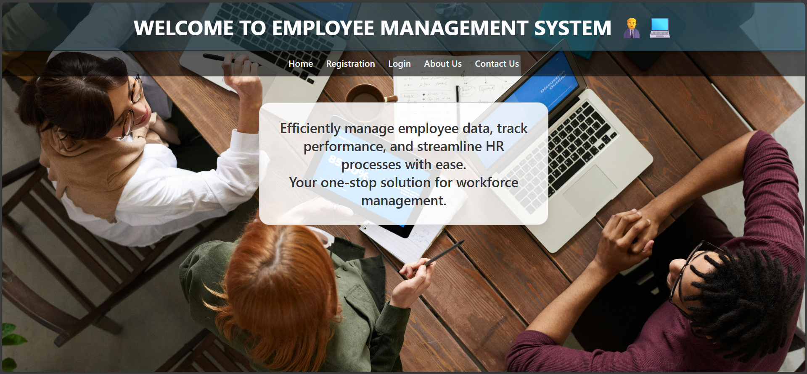 | 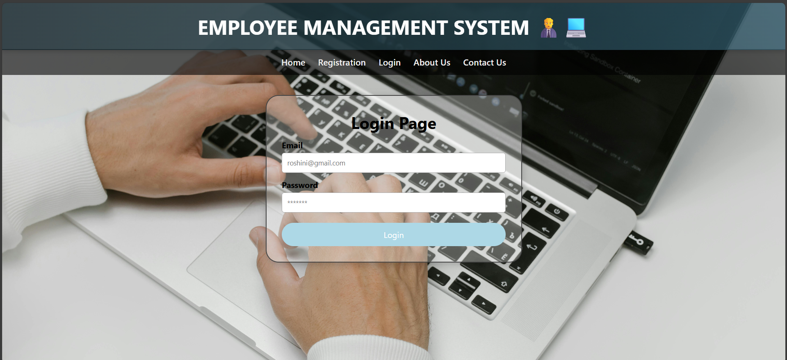 |

| 🧾 Register Page | 🛡️ Security Login | 👥 Admin Dashboard |
|------------------|------------------|---------------------|
| 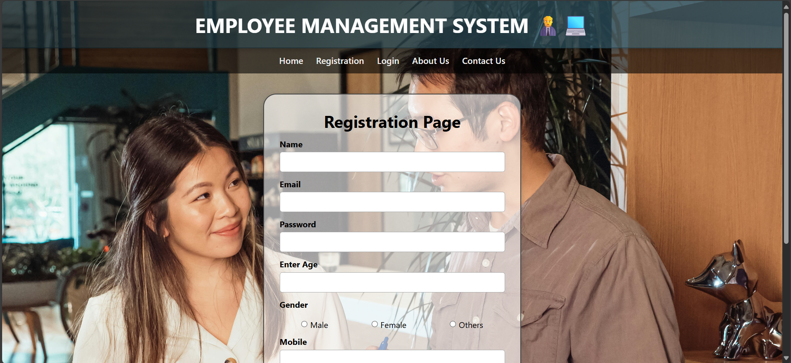 | 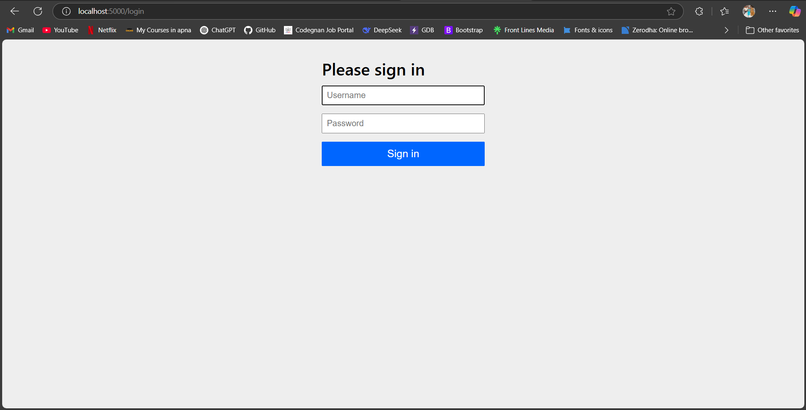 | 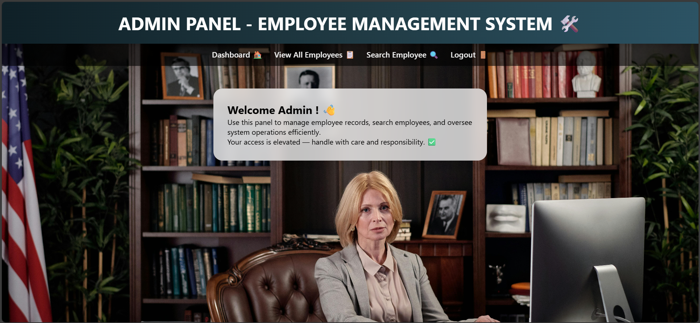 |

| 🔍 Search Employees | 👁️ View All Employees | 👤 View Employee |
|---------------------|------------------------|------------------|
| 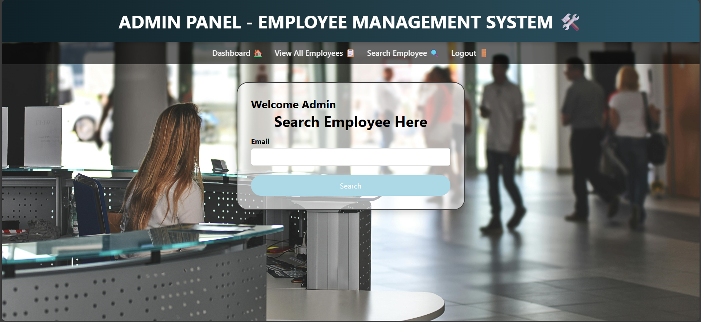 | 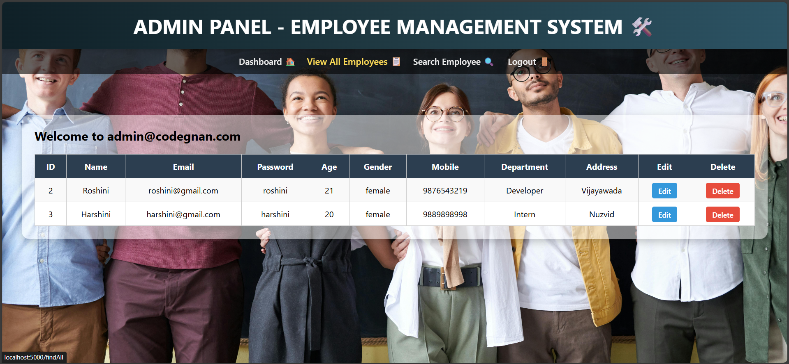 | 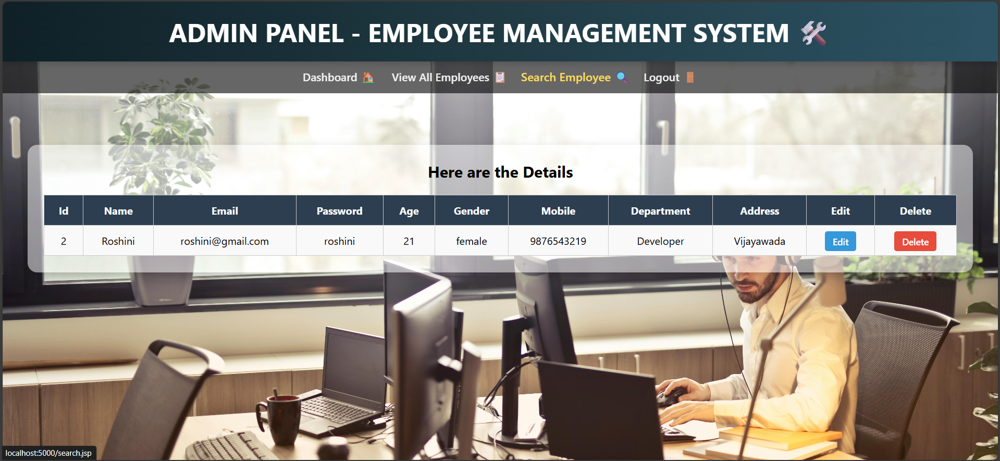 |

| ✏️ Edit Employee | 🧑 View Profile | ℹ️ About Us |
|------------------|------------------|-------------|
| 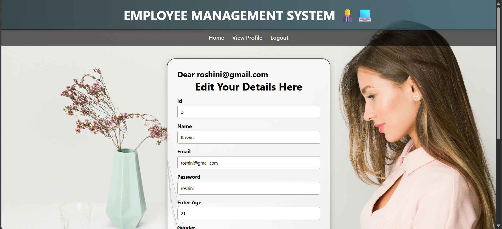 | 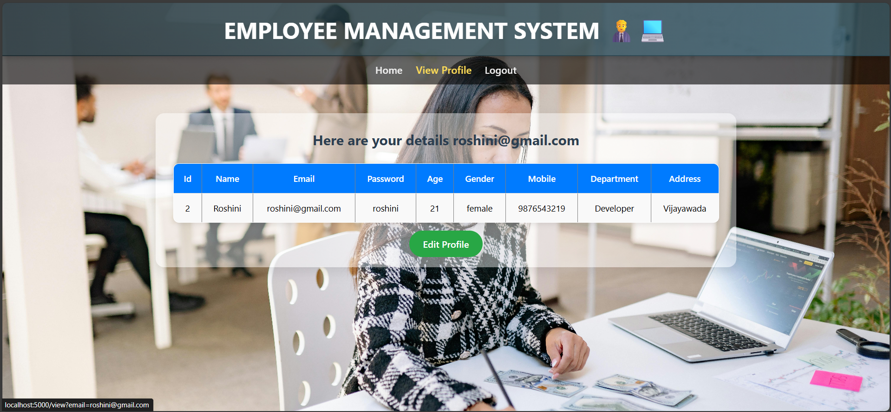 | 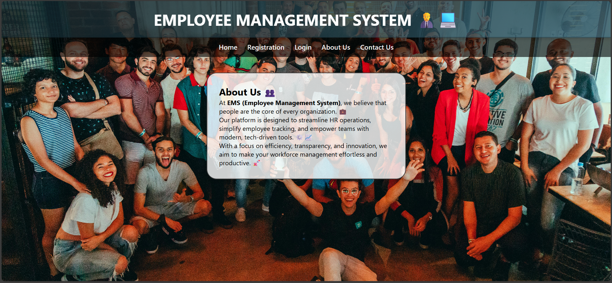 |

| 📞 Contact Us |
|---------------|
| 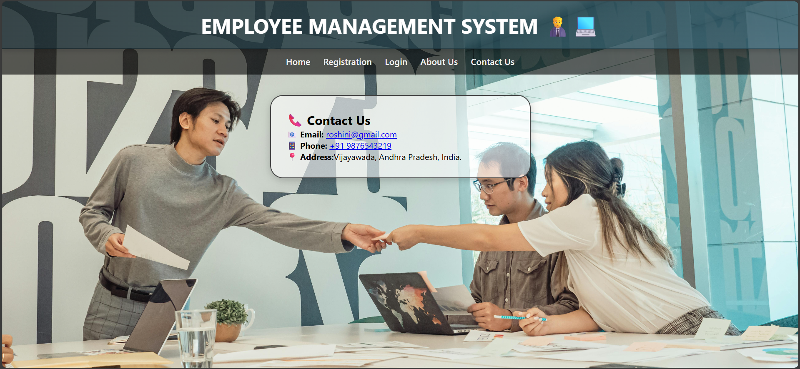 |

---

##  Developed By 👩‍💻
Roshini Yajjavarapu
📧 roshini.ece2024.rce@gmail.com
🎓 B.Tech (Electronics & Communication Engineering)
🌐 [LinkedIn](https://www.linkedin.com/in/roshini-y-291905253/)
🌍 Passionate about Full Stack Development & Software Engineering
